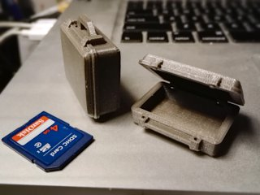
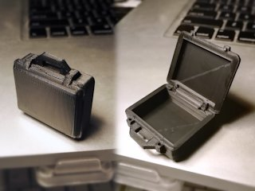

# Hinged Mini Pelican Case 2.0
*3D printable miniature Pelican-like Suitcase (formerly thing:1874675)*

### License
[Creative Commons - Attribution - Non Commercial - Share Alike](https://creativecommons.org/licenses/by-nc-sa/4.0/)

### Attribution
This is a remix of schlem's Mini Pelican Case ([Thingiverse thing:41960](http://www.thingiverse.com/thing:41960)).

### Gallery

[🔎](images/case1.jpg) [🔎](images/case2.jpg)

## Description and Instructions

Although intended as a mini prop, this has also proved practical as a tiny pill box for temporary use, which looks cool as an added bonus.

The original model from schlem proved to be rather ‘dirty’ and nearly impossible to edit. Hence I rebuilt most of it to get rid of all the gaps and awkwardly connected facets, which enabled me to design an even smaller-than-mini version. The original model has an inside volume of 34×26×12 mm and can hold five SD cards. The mini model has a volume of 34×22×11.25 mm (but is too small for an SD card).

Another improvement is that this version has sensible tolerances for FDM printers, and an improved hinge that is less likely to detach.

There are two versions of the files: the v3 is the easiest to print, has a better hinge design, and will also likely be stronger than the v2 if you plan to use this to actually store things. The v3 version still is not an easy print though, and will require a well-calibrated printer if you want to end up with a usable result.
 

### Print settings

A layer height of at most 0.1 mm is pretty much obligatory to ensure the details come out right.
Supports are essential for the original model with handle. The mini model might be printable without supports, but it will look a lot better with them. The v3 files are offered in a variation that has minimal built-in supports.

(If you wonder what the ugly diagonal line is in the photo of the black case, it is caused by the nozzle marring the meticulously printed top surface by doing a travel move across it. This used to be typical dumb behaviour in Slic3r/PrusaSlicer, but luckily they fixed this in recent releases.)
 

### Post-Printing

The v3 version should be usable right away. Before you push the base and lid together to snap the hinge in place, check if there aren't any obvious blobs or oozing that could be in the way, and scrape them off with a knife if necessary. If the lid won't close entirely, you may have to ream the holes a bit until the little nubs fit in them.

On a well-calibrated printer, the hinge should move smoothly or have a bit of friction, but it should not be sloppy and it shouldn't require inordinate force to push it together.

## Updates

### 2017/02/18
I added a **‘v3’** version which has a much improved hinge design that is easier to print and much less prone to breaking. This hinge will also easily turn across a range of 115°. The v3 files also come in a variation with built-in supports. The v3 version is definitely the one you'll want to print, but I left the v2 models available.

## Tags
`box`, `case`, `hinge`, `miniature`, `model`, `Pelican`, `printer_calibration`, `prop`, `SD_Card_Holder`, `Suitcase`, `toy`
